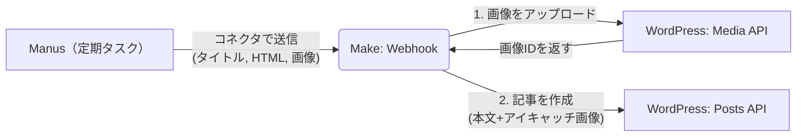

# Manus(manul) × Make × WordPress 自動投稿の実装プラン

いただいた情報と画像から、お使いのツールが「**Manus**」であり、**Make（旧Integromat）**のコネクタが利用できることが確認できました。また、成果物が「画像」と「HTMLファイル」として出力されることも把握しました。

これらを最も確実に、かつ簡単に全自動化するには、**Make（ノーコード連携ツール）** をハブにしてデータをつなぐ方法が最適です。サーバーの構築や複雑なプログラミングは不要です。

## 全体の仕組み（ワークフロー）



---

## 必要な設定ステップの概要

この自動化を実現するために、以下の3つのサービスで設定を行います。

### 1. WordPress側の準備
- **アプリケーションパスワードの発行:**
  WordPressの管理画面（ユーザー > プロフィール）から、MakeがWordPressを操作するための「アプリケーションパスワード」を発行します。これによりID/パスワードを直接渡さず安全に通信できます。

### 2. Make（旧Integromat）のシナリオ作成
Makeのアカウント（無料プランで十分可能です）を作成し、以下の3ステップのシナリオ（自動化の流れ）を作ります。
1. **Custom Webhook (トリガー):** Manusからデータ（タイトル、HTML、画像ファイル）を受け取る窓口を作ります。
2. **WordPress (Upload Media):** 受け取った画像をWordPressのメディアライブラリにアップロードします。
3. **WordPress (Create a Post):** Manusから受け取ったHTMLを本文とし、手順2でアップロードした画像を「アイキャッチ画像（Featured Image）」に設定して、記事を下書き（または公開）で作成します。

### 3. Manus（プロンプト）のアップデート
Manusが記事作成後にMakeへ自動送信するよう、現在のプロンプト（指示文）の **「8. Final Output Execution」** と **「9. Technical Output Syntax」** を修正します。

**【プロンプト修正案】**
```markdown
## 8. Final Output Execution
1. **記事の生成:** 上記のルールに従い、高品質な分析記事を執筆し、HTML形式のファイルとして生成。
2. **画像の生成:** 記事のトピックを象徴する画像を生成。
3. **Makeへのデータ送信（New!）:** 
   Makeコネクタを利用し、生成した「記事のタイトル」「HTMLファイルのテキストコンテンツ（本文）」「生成した画像データ」を事前に指定されたWebhookURLへ送信してください。
4. **完了:** 送信完了の報告をもってタスク完了とする。
```

---

## 次のアクション

プロンプトや環境の確認ができましたので、**「Makeの具体的な設定手順」と「WordPressの具体的な設定手順」をまとめた詳細なマニュアル（Walkthrough）を作成**いたしました。
そちらを見ながらセットアップを進めていただくことが可能です。
